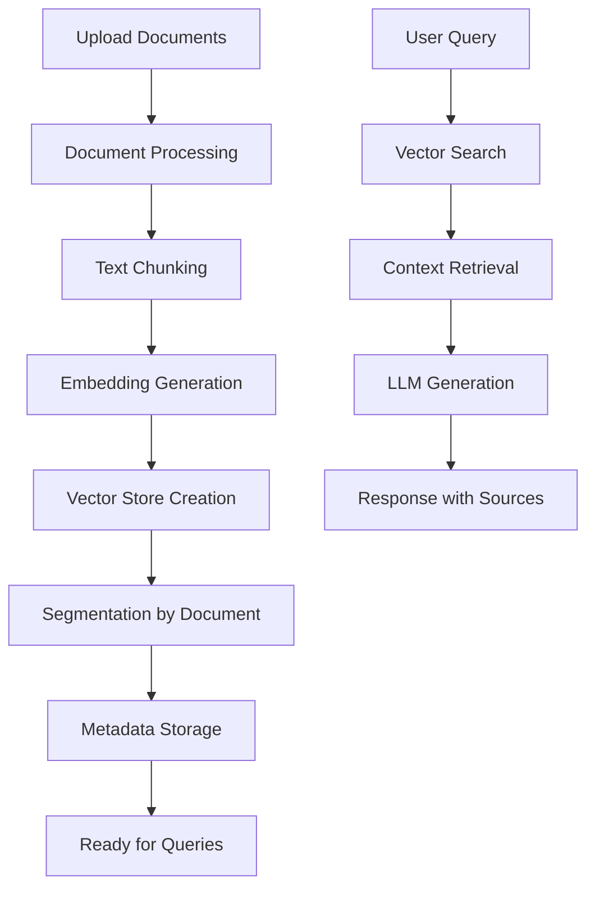

# Chat Multi-Documents avec Vector Stores Segmentés

Un système RAG (Retrieval-Augmented Generation) avancé permettant de converser avec multiple documents en utilisant des vector stores segmentés pour une recherche optimisée et une gestion intelligente des sources.


## Caractéristiques Principales

### Support Multi-Formats
- **Documents** : PDF, DOCX, TXT, XLSX, XLS, CSV, PPTX
- **Sources Web** : URLs avec extraction intelligente du contenu
- **Texte brut** : Saisie directe de texte personnalisé

### Modèles Avancés
- **Embeddings** : OpenAI, HuggingFace (Instructor-XL, Sentence Transformers, BGE, Multilingual)
- **LLM** : Google Gemini 2.0 Flash, Gemini Pro 1.5, Gemini Pro
- **Personnalisation** : Paramètres de température et chunk size ajustables

### Vector Stores Segmentés
- **Segmentation par document** : Organisation intelligente des embeddings
- **Recherche ciblée** : Interrogation de documents spécifiques
- **Persistance** : Sauvegarde automatique avec métadonnées complètes
- **Gestion avancée** : Nettoyage automatique et combinaison de segments

### Interface Conversationnelle
- **Chat interactif** : Interface Streamlit moderne
- **Historique** : Conservation des conversations
- **Sources transparentes** : Traçabilité des réponses avec références
- **Statistiques** : Monitoring en temps réel

## Installation

### Prérequis
- Python 3.8+
- Clés API Google Gemini et/ou OpenAI

### Installation des dépendances

```bash
# Cloner le repository
git clone https://github.com/votre-username/rag-multi-documents.git
cd rag-multi-documents

# Créer un environnement virtuel
python -m venv venv

venv\Scripts\activate  # Windows

# Installer les dépendances
pip install -r requirements.txt
```

### Configuration des variables d'environnement

Créez un fichier `.env` à la racine du projet :

```env
# Clé API Google Gemini (obligatoire)
GOOGLE_API_KEY=votre_cle_api_gemini

# Clé API OpenAI (optionnelle, pour les embeddings OpenAI)
OPENAI_API_KEY=votre_cle_api_openai
```

## Fichier requirements.txt

```txt
aiohappyeyeballs==2.6.1
aiohttp==3.12.13      
aiosignal==1.4.0      
altair==4.0.0
annotated-types==0.7.0
anyio==3.7.1
async-timeout==4.0.3  
attrs==25.3.0
beautifulsoup4==4.13.4
blinker==1.9.0
cachetools==5.5.2
certifi==2025.6.15
charset-normalizer==3.4.2
click==8.2.1
colorama==0.4.6
contourpy==1.3.2
cycler==0.12.1
dataclasses-json==0.5.14
dnspython==2.7.0
docx2txt==0.9
entrypoints==0.4
et_xmlfile==2.0.0
exceptiongroup==1.3.0
faiss-cpu==1.7.4
filelock==3.18.0
filetype==1.2.0
fonttools==4.59.0
frozenlist==1.7.0
fsspec==2025.5.1
gitdb==4.0.12
GitPython==3.1.44
google-ai-generativelanguage==0.6.18
google-api-core==2.25.1
google-api-python-client==2.175.0
google-auth==2.40.3
google-auth-httplib2==0.2.0
google-generativeai==0.4.1
googleapis-common-protos==1.70.0
greenlet==3.2.3
grpcio==1.73.1
grpcio-status==1.62.3
h11==0.16.0
httpcore==1.0.9
httplib2==0.22.0
httpx==0.28.1
huggingface-hub==0.14.1
idna==3.10
importlib_metadata==8.7.0
InstructorEmbedding==1.0.1
Jinja2==3.1.6
joblib==1.5.1
jsonpatch==1.33
jsonpointer==3.0.0
jsonschema==4.24.0
jsonschema-specifications==2025.4.1
kiwisolver==1.4.8
langchain==0.3.26
langchain-community==0.0.38
langchain-core==0.3.72
langchain-google-genai==2.1.8
langchain-mongodb==0.6.2
langchain-text-splitters==0.3.8
langsmith==0.4.8
lark==1.2.2
lxml==6.0.0
markdown-it-py==3.0.0
MarkupSafe==3.0.2
marshmallow==3.26.1
matplotlib==3.10.3
mdurl==0.1.2
mpmath==1.3.0
multidict==6.6.3
mypy_extensions==1.1.0
networkx==3.4.2
nltk==3.9.1
numexpr==2.11.0
numpy==1.26.4
openai==0.27.6
openapi-schema-pydantic==1.2.4
openpyxl==3.1.5
orjson==3.10.18
packaging==23.2
pandas==2.3.0
pillow==11.3.0
propcache==0.3.2
proto-plus==1.26.1
protobuf==4.25.8
pyarrow==20.0.0
pyasn1==0.6.1
pyasn1_modules==0.4.2
pydantic==2.11.7
pydantic_core==2.33.2
pydeck==0.9.1
Pygments==2.19.2
pymongo==4.13.2
Pympler==1.1
pyparsing==3.2.3
PyPDF2==3.0.1
python-dateutil==2.9.0.post0
python-docx==1.2.0
python-dotenv==1.0.0
pytz==2025.2
pywin32==310
PyYAML==6.0.2
referencing==0.36.2
regex==2024.11.6
requests==2.32.4
requests-toolbelt==1.0.0
rich==14.0.0
rpds-py==0.26.0
rsa==4.9.1
safetensors==0.5.3
scikit-learn==1.7.0
scipy==1.15.3
semver==3.0.4
sentence-transformers==2.2.2
sentencepiece==0.2.0
six==1.17.0
smmap==5.0.2
sniffio==1.3.1
soupsieve==2.7
SQLAlchemy==2.0.41
streamlit==1.46.1
sympy==1.14.0
tenacity==8.5.0
threadpoolctl==3.6.0
tiktoken==0.4.0
tokenizers==0.13.3
toml==0.10.2
toolz==1.0.0
torch==2.7.1
torchvision==0.22.1
tornado==6.5.1
tqdm==4.67.1
transformers==4.31.0
typing-inspect==0.9.0
typing-inspection==0.4.1
typing_extensions==4.14.1
tzdata==2025.2
tzlocal==5.3.1
uritemplate==4.2.0
urllib3==2.5.0
validators==0.35.0
watchdog==6.0.0
xlrd==2.0.2
yarl==1.20.1
zipp==3.23.0
zstandard==0.23.0
```

## Utilisation

### Lancement de l'application

```bash
streamlit run main.py
```

L'application sera accessible sur `http://localhost:8501`

### Guide d'utilisation rapide

1. **Configuration des modèles**
   - Sélectionnez votre modèle d'embedding dans la barre latérale
   - Choisissez le modèle LLM (Gemini)
   - Ajustez les paramètres avancés si nécessaire

2. **Ajout de documents**
   - Uploadez vos fichiers via l'onglet "Documents"
   - Ajoutez des URLs à traiter
   - Configurez un nom personnalisé pour votre vector store

3. **Traitement et indexation**
   - Cliquez sur "Traiter les documents"
   - Le système créera automatiquement un vector store segmenté
   - Chaque document sera indexé séparément pour une recherche optimisée

4. **Conversation**
   - Utilisez l'onglet "Chat" pour poser vos questions
   - Le système recherchera dans les documents pertinents
   - Les sources utilisées sont affichées avec chaque réponse

5. **Gestion des vector stores**
   - Consultez tous vos vector stores dans l'onglet dédié
   - Chargez des segments spécifiques
   - Combinez plusieurs documents pour des requêtes ciblées

##  Architecture

### Structure du projet

```
projet/
├── Franck.py                     # Application Streamlit principale
├── htmlTemplates.py           # Templates HTML pour l'interface
├── requirements.txt           # Dépendances Python
├── .env                      # Variables d'environnement
├── README.md                 # Documentation
├── vectorstores/            # Stockage des vector stores
│   └── faiss_db_*/         # Répertoires des bases FAISS
├── cache/                  # Cache temporaire
└── logs/                  # Fichiers de logs
```

### Composants principaux

#### `SegmentedVectorStoreManager`
- Gestion des vector stores FAISS avec segmentation
- Sauvegarde et chargement persistants
- Métadonnées complètes et traçabilité
- Nettoyage automatique

#### `DocumentProcessor`
- Traitement multi-format avec métadonnées
- Extraction intelligente du contenu
- Gestion des erreurs robuste
- Statistiques de traitement

#### Interface Streamlit
- Navigation par onglets
- Configuration temps réel
- Visualisation des statistiques
- Gestion des erreurs utilisateur

### Flux de traitement



## Configuration Avancée

### Paramètres de chunking

```python
# Taille des chunks (caractères)
chunk_size = 1000  # Ajustable : 500-2000

# Chevauchement entre chunks
chunk_overlap = 200  # Ajustable : 50-300
```

### Paramètres de recherche

```python
# Nombre de documents à récupérer
k_documents = 4  # Ajustable : 1-10

# Type de recherche vectorielle
search_type = "similarity"  # similarity, mmr

# Seuil de similarité
similarity_threshold = 0.7
```

### Paramètres LLM

```python
# Température (créativité)
temperature = 0.3  # 0.0 (factuel) à 1.0 (créatif)

# Tokens maximum
max_tokens = 1000

# Top-p sampling
top_p = 0.9
```

## API et Extensions

### Utilisation programmatique

```python
from main import DocumentProcessor, SegmentedVectorStoreManager

# Initialisation
processor = DocumentProcessor()
vs_manager = SegmentedVectorStoreManager()

# Traitement de documents
documents = processor.process_files(files)

# Création du vector store
vectorstore = create_vectorstore(
    documents, 
    embeddings, 
    vs_manager, 
    "HuggingFace BGE Small"
)

# Requête
results = vectorstore.similarity_search("votre question", k=5)
```

### Extension avec de nouveaux formats

```python
def process_custom_format(self, file) -> List[LangchainDocument]:
    """Ajouter le support d'un nouveau format"""
    try:
        # Logique d'extraction
        content = extract_content(file)
        
        # Créer le document avec métadonnées
        metadata = self.create_metadata(
            source=file.name,
            doc_type="custom",
            size=len(content)
        )
        
        return [LangchainDocument(
            page_content=content,
            metadata=metadata
        )]
    except Exception as e:
        self.errors.append(f"Erreur {file.name}: {str(e)}")
        return []
```

## Monitoring et Logs

### Fichiers de logs

Les logs sont automatiquement générés dans le répertoire `logs/` :

- `app.log` : Logs généraux de l'application
- `errors.log` : Erreurs détaillées
- `performance.log` : Métriques de performance

### Métriques disponibles

- Temps de traitement des documents
- Taille des vector stores
- Nombre de requêtes traitées
- Taux de succès par type de document
- Utilisation mémoire et stockage

## Sécurité et Confidentialité

### Protection des données
- **Traitement local** : Tous les documents sont traités localement
- **Chiffrement** : Vector stores peuvent être chiffrés
- **Nettoyage automatique** : Suppression des données temporaires
- **Logs anonymisés** : Pas de contenu sensible dans les logs

### Bonnes pratiques
- Utilisez des variables d'environnement pour les clés API
- Limitez l'accès au répertoire `vectorstores/`
- Activez HTTPS en production
- Vérifiez régulièrement les dépendances

## Dépannage

### Problèmes courants

#### Erreur de mémoire lors du traitement
```bash
# Réduire la taille des chunks
chunk_size = 500
chunk_overlap = 50
```

#### Échec de création des embeddings
```bash
# Vérifier les clés API
echo $GOOGLE_API_KEY
echo $OPENAI_API_KEY

# Tester la connectivité
ping api.openai.com
```

#### Vector store corrompu
```python
# Supprimer et recréer
vs_manager.delete_vectorstore(vectorstore_id)
```

### Performances lentes

1. **Réduire la taille des documents** : Limitez à 10MB par fichier
2. **Optimiser les chunks** : Équilibrer taille et pertinence
3. **Utiliser un SSD** : Pour le stockage des vector stores
4. **Augmenter la RAM** : Minimum 8GB recommandé

## Contribution

### Guide de contribution

1. **Fork** le projet
2. **Créer** une branche feature (`git checkout -b feature/AmazingFeature`)
3. **Commit** vos changements (`git commit -m 'Add some AmazingFeature'`)
4. **Push** vers la branche (`git push origin feature/AmazingFeature`)
5. **Ouvrir** une Pull Request

### Standards de code

- **PEP 8** : Style Python standard
- **Docstrings** : Documentation des fonctions
- **Type hints** : Annotations de types
- **Tests unitaires** : Coverage minimum 80%

### Roadmap

- [ ] Support des images (OCR)
- [ ] API REST complète
- [ ] Interface mobile
- [ ] Déploiement Docker
- [ ] Support multi-langues
- [ ] Intégration bases de données
- [ ] Authentification utilisateurs
- [ ] Partage de vector stores

## Licence

Ce projet est sous licence MIT. Voir le fichier `LICENSE` pour plus de détails.

##  Remerciements

- **LangChain** : Framework RAG puissant
- **Streamlit** : Interface utilisateur simple
- **FAISS** : Recherche vectorielle efficace  
- **Google Gemini** : Modèles LLM performants
- **HuggingFace** : Modèles d'embeddings

##  Support

- **Issues GitHub** : Pour les bugs et demandes de fonctionnalités
- **Documentation** : Wiki du projet
- **Communauté** : Discord/Slack (liens à venir)

---


*Dernière mise à jour : 2025*